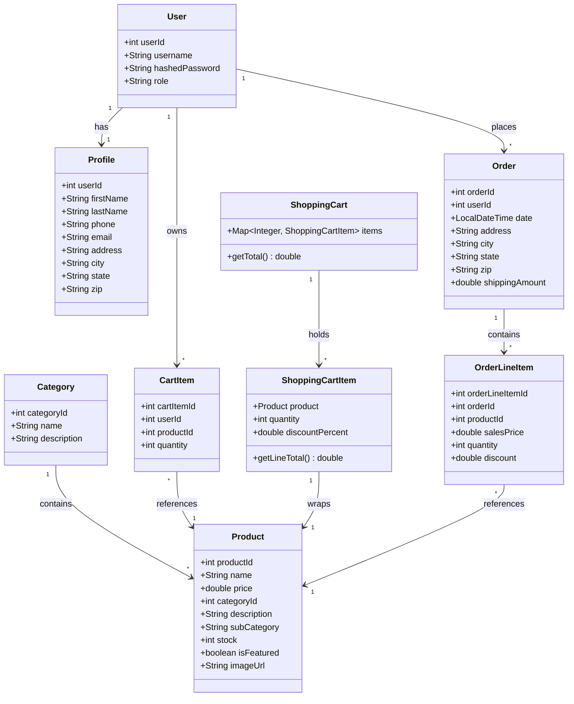
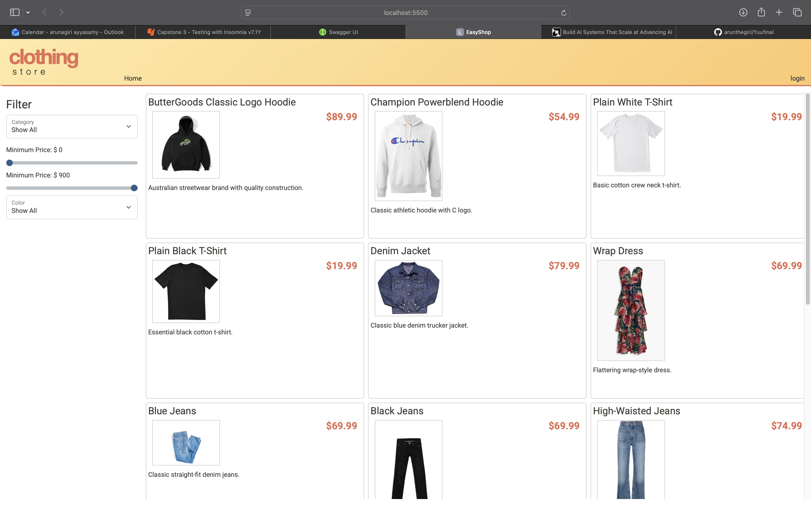
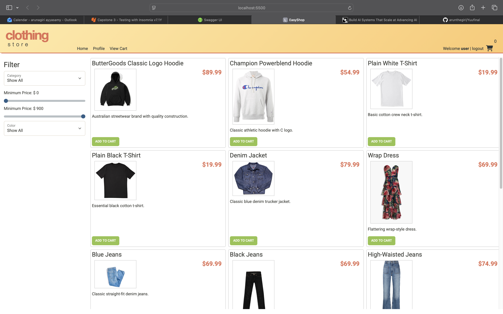
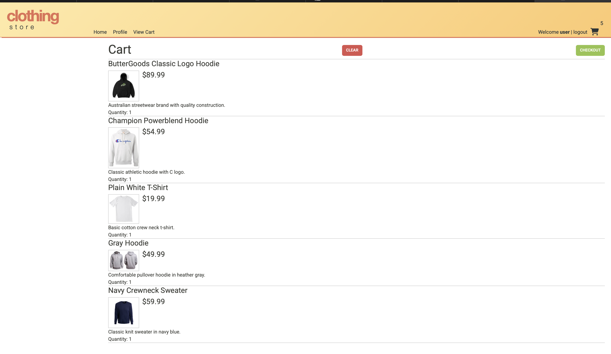
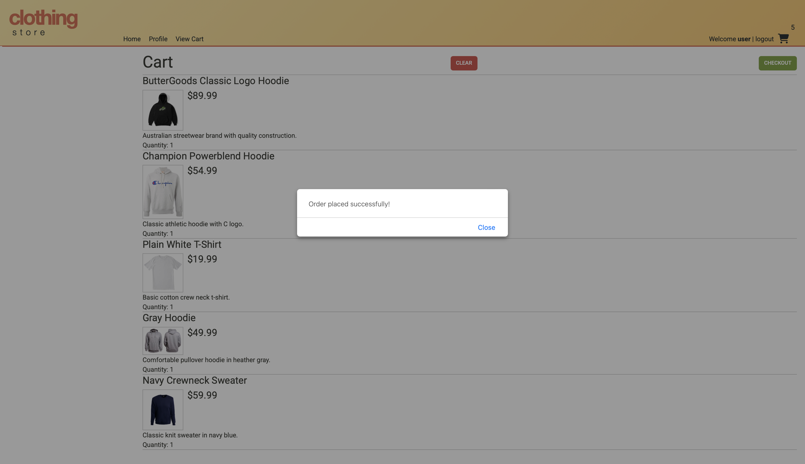

# EasyShop — E-Commerce API

A Spring Boot REST API backend for the EasyShop clothing store. Built as Capstone 3 for Year Up. The API powers a full e-commerce frontend with product browsing, category filtering, shopping cart, user profiles, and order checkout.

---

## Tech Stack

| Layer | Technology |
|-------|-----------|
| Language | Java 17 |
| Framework | Spring Boot 4 |
| Security | Spring Security + JWT |
| Database | MySQL |
| ORM | Spring Data JPA / Hibernate |
| Build | Maven |
| Testing | JUnit 5 + Mockito |
| Docs | Swagger UI (SpringDoc OpenAPI) |

---

## Features

- **User auth** — register, login, JWT token issued on login
- **Product search** — filter by category, price range, and subcategory
- **Categories** — full CRUD (admin only for write operations)
- **Shopping cart** — add, update quantity, clear; persists across sessions
- **User profile** — view and update personal details
- **Checkout** — converts cart to a saved order, clears cart on completion

---

## Class Diagram



---

## API Endpoints

### Authentication (public)

| Verb | URL | Description |
|------|-----|-------------|
| POST | `/register` | Create a new user account |
| POST | `/login` | Login and receive a JWT token |

### Products (public read, admin write)

| Verb | URL | Description |
|------|-----|-------------|
| GET | `/products` | List all products; supports `cat`, `minPrice`, `maxPrice`, `subCategory` filters |
| GET | `/products/{id}` | Get a single product |
| POST | `/products` | Create a product (admin) |
| PUT | `/products/{id}` | Update a product (admin) |
| DELETE | `/products/{id}` | Delete a product (admin) |

### Categories (public read, admin write)

| Verb | URL | Description |
|------|-----|-------------|
| GET | `/categories` | List all categories |
| GET | `/categories/{id}` | Get a single category |
| GET | `/categories/{id}/products` | List all products in a category |
| POST | `/categories` | Create a category (admin) |
| PUT | `/categories/{id}` | Update a category (admin) |
| DELETE | `/categories/{id}` | Delete a category (admin) |

### Shopping Cart (login required)

| Verb | URL | Description |
|------|-----|-------------|
| GET | `/cart` | Get current user's cart |
| POST | `/cart/products/{id}` | Add product; increments quantity if already in cart |
| PUT | `/cart/products/{id}` | Update quantity of a cart item |
| DELETE | `/cart` | Clear all items from cart |

### Profile (login required)

| Verb | URL | Description |
|------|-----|-------------|
| GET | `/profile` | Get current user's profile |
| PUT | `/profile` | Update current user's profile |

### Orders / Checkout (login required)

| Verb | URL | Description |
|------|-----|-------------|
| POST | `/orders` | Convert cart to an order and clear the cart |

---

## Running the API Locally

**Prerequisites:** Java 17+, MySQL running locally, Maven

1. Create the database:
   ```
   mysql -u root -p < database/create_database_clothingstore.sql
   ```

2. Create `src/main/resources/application-local.properties`:
   ```properties
   spring.datasource.url=jdbc:mysql://localhost:3306/clothingstore
   spring.datasource.password=YOUR_PASSWORD
   jwt.secret=YOUR_JWT_SECRET
   ```

3. Start the API:
   ```bash
   SPRING_PROFILES_ACTIVE=local ./mvnw spring-boot:run
   ```

4. API is live at `http://localhost:8080`

5. Swagger UI available at `http://localhost:8080/swagger-ui/index.html`

**Demo credentials (all passwords are `password`):**

| Username | Role |
|----------|------|
| `user` | ROLE_USER |
| `admin` | ROLE_ADMIN |
| `george` | ROLE_USER |

---

## Interesting Code — Bug Fix: Product Search

The most interesting fix in this project was in `ProductService.search()`. The original code had a hardcoded `.filter(Product::isFeatured)` at the end of the search stream with no corresponding request parameter — silently hiding every non-featured product from every search result:

```java
// BEFORE — only 5 of 12 products ever returned
return products.stream()
               .filter(p -> minPrice == null || p.getPrice() >= minPrice)
               .filter(p -> maxPrice == null || p.getPrice() <= maxPrice)
               .filter(p -> subCategory == null || subCategory.equalsIgnoreCase(p.getSubCategory()))
               .filter(Product::isFeatured)   // bug: always applied, no parameter to disable it
               .toList();

// AFTER — all matching products returned
return products.stream()
               .filter(p -> minPrice == null || p.getPrice() >= minPrice)
               .filter(p -> maxPrice == null || p.getPrice() <= maxPrice)
               .filter(p -> subCategory == null || subCategory.equalsIgnoreCase(p.getSubCategory()))
               .toList();
```

The fix was one line removed, but finding it required comparing the live API response count against the actual database row count. Without the fix, 7 out of 12 products were permanently invisible to every user.

---

## Application Screenshots

### Home / Product Listing


### Product Search with Filters


### Shopping Cart


### Checkout


---

## Project Board

Issues and progress tracked on GitHub: [View Project Issues](https://github.com/arunthegiri/Yuufinal/issues)
